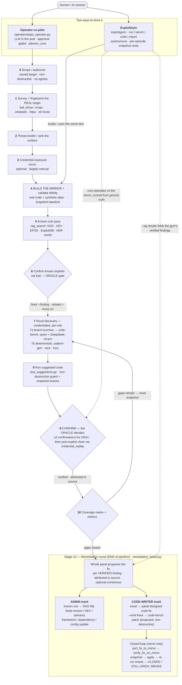
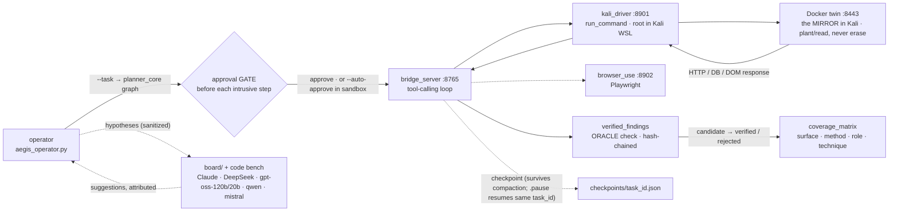
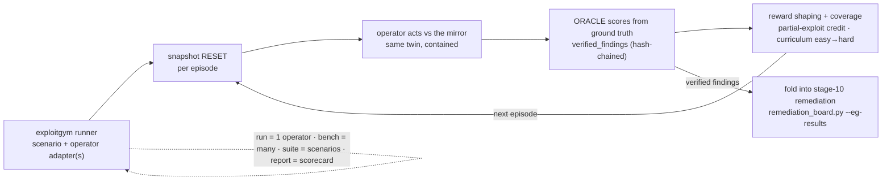

# HELP — operator runbook companion

Task-oriented how-tos for the human driving the Aegis stack. The co-pilot can also read this file at
runtime via its `search_docs` tool, so keep answers concrete. Doctrine and the full pipeline live in
`.claude/skills/aegis/SKILL.md` and `docs/PIPELINE.md`.

---

## The whole app at a glance — full pipeline for the Operator and ExploitGym (start → end)

Two ways to drive the exact same machine. The **Operator co-pilot** puts an LLM in the seat with a human
approval gate (interactive assessment). **ExploitGym** runs the same operator autonomously against a
scenario and scores it (benchmark). **Both hit the same MIRROR twin, are judged by the same deterministic
ORACLE, and end at the same stage-10 remediation round.** Nothing aggressive ever touches production.

### 1) The full pipeline (0 → 10), both drivers



### 2) Operator runtime loop (how one step actually executes)



### 3) ExploitGym episode loop (the benchmark)



### Components & ports (legend)

| Piece | Where | Role |
|---|---|---|
| Operator co-pilot | `operator/aegis_operator.py` | LLM in the seat: approval gate, ledger/memory, tool-loop, `rag_search`; providers deepseek \| openai \| cloudflare |
| Bridge | `orchestrator/bridge_server.py` **:8765** | The executor — OpenAI-compatible tool-calling loop, checkpoint/pause/resume |
| Kali driver | `orchestrator/kali_driver_server.py` **:8901** | One MCP tool `run_command`, root shell inside Kali WSL (where the twin + tools live) |
| Browser | `orchestrator/browser_use_server.py` **:8902** | Playwright automation as MCP tools |
| Mirror twin | Docker in Kali **:8443** | The contained copy of the real target — every aggressive action hits here, never prod |
| ExploitGym | `exploitgym/` | Autonomous-exploitation **benchmark** — `run \| bench \| suite \| report`, scored from ground truth |
| Verification spine | `shared/verified_findings.py` + `coverage_matrix.py` | The ORACLE (hash-chained, verified-only) + gap grid — shared by operator **and** gym |
| Offline vuln RAG | `/opt/aegis-rag` | NVD/KEV/EPSS/Exploit-DB/MSF/PoC/nuclei — feeds stages 5 and 10 |
| Board | `board/` + `operator/cf_agent.py` | Multi-model chat (Claude · DeepSeek · gpt-oss-120b/20b · qwen-coder · mistral-small · kimi · llama; Sol booted) |

**Cross-cutting (always true):** the board is *consulted at decision points* 0·2·4·5·7·10 (not a blocking
gate on every step); privileged context (creds/secrets) is **sanitized** before generalist models see it;
the **deterministic oracle** decides verified/rejected (Claude never self-certifies; HIGH needs ≥2
confirmations); everything aggressive runs on the **mirror**, guarded + snapshot-restored; every verified
finding is **attributed** to the model/method/CVE that produced it. Full prose: `docs/PIPELINE.md`.

---

## Getting improved code onto the mirror for testing (stage-10 closed loop)

**The situation.** Stage 10 (`remediation_board.py --emit-fixes`, or the operator's `remediation(emit_fixes=true)`
tool) has the **code writer/improver** (deepseek-v4-pro + qwen-coder) emit a concrete patch for each verified
weakness, on the **HOST**:

```
operator/remediation_fixes/<finding-id>__<writer>.md      # each is FILE / PATCH / NOTE
```

The **mirror twin** you test against is a *separate machine/OS*, and **its OS varies with the target** — it may
be **Ubuntu, openSUSE, Debian, Kali, or a Docker image of any base**, reached over WSL, Docker, or a hand-carry
to an air-gapped box. To run the mirror-only closed loop — *apply the improved code, then re-run the finding's
exploit/oracle to confirm the gap is CLOSED* — the patch must be carried into that mirror. That transport is
`operator/remediation_port.py` (operator tool: `port_fix_to_mirror`). **MIRROR-side only: it STAGES the patch,
never auto-applies it, and never touches the real target.**

### What YOU need to do to hand improved files to the operator

1. **Shape the file.** Best is a **unified diff that `git apply`s cleanly** against the mirror's copy of the
   code — include the real target path in the diff header (`a/<path>` `b/<path>`). The code bench's
   `FILE / PATCH / NOTE` markdown is fine too; whoever applies it extracts the `PATCH` block. If you improved
   the code by hand, `git diff > myfix.diff` in a checkout of the mirror's code is ideal.
2. **Name it** `<finding-id>__<who>.md` (or `.diff`) — e.g. `77a7588bfc18__me.diff` — so it stays grouped with
   its finding.
3. **Put it where the operator looks:** drop it into `operator/remediation_fixes/`, **or** keep it anywhere and
   pass `--fixes-dir <your-dir>` to `remediation_port.py`.
4. **Tell the code writer the mirror's stack** so its patch fits: OS/distro (Ubuntu/SUSE/…), language/framework
   and version, and file layout. A fix that assumes the wrong package manager or paths won't apply. (Set
   `AEGIS_MIRROR_DISTRO` so the tools default to the right WSL distro.)
5. **Port it** with the transport that matches where the mirror is (below).

### Choose the transport by where/what the mirror is

**A. WSL mirror — ANY distro (Ubuntu, openSUSE, Kali, …).** Nothing to plug in; WSL shares the filesystem.
```
python operator/remediation_port.py --transport wsl --distro <distro>      # e.g. Ubuntu-22.04, openSUSE-Tumbleweed
#   (or set AEGIS_MIRROR_DISTRO once; default is kali-linux)
# copies each patch into the distro at /opt/aegis-mirror-fixes/
```

**B. Docker mirror — any base image (the twin container).** Make sure it's running, get its name, then:
```
docker ps                                   # find the mirror container name
python operator/remediation_port.py --transport docker --container <name>
# uses `docker cp` into /tmp/aegis-fixes in the container
```

**C. USB / removable media / a separate or air-gapped mirror box.** Plug the drive in, note its mount, stage,
then hand-carry:
```
python operator/remediation_port.py --transport dir --dest E:/aegis-usb      # Windows drive letter
#   (or --dest /mnt/usb from inside the mirror)
```
Carry the drive to the mirror machine and apply there.

**D. Plain files / a shared folder.** Same as USB, point `--dest` at a path both sides can see:
```
python operator/remediation_port.py --transport dir --dest //server/share/aegis-fixes
```

### Apply + re-test — on the mirror, with the mirror's own tools
The **apply** step runs inside the mirror and uses *that* OS's tooling (its package manager for a dependency
bump, its paths for a config/code change):
```
# inside the mirror (WSL/Docker/box): extract the PATCH diff, then
cd <mirror-repo> && git apply <extracted.diff>        # or: patch -p1 < <extracted.diff>
# framework/dependency (ADMIN) fixes use the mirror OS's manager: apt/zypper/dnf, npm, pip, composer, ...
# then RE-RUN the finding's exploit/oracle -> it should now report the weakness CLOSED.
```
If the oracle still fires, the fix is insufficient — feed that back to the code writer and iterate. Everything
stays on the mirror; the real target is never modified or re-tested.

### The loop, end to end (automated by `remediation_verify.py` / `verify_fix_on_mirror`)
1. `remediation(emit_fixes=true)` → patches in `operator/remediation_fixes/`.
2. `port_fix_to_mirror(transport=…)` → patch staged inside the mirror (WSL/Docker/USB).
3. `verify_fix_on_mirror`: snapshot → APPLY (code `git apply` + framework bump via the mirror OS's package
   manager; `--allow-download` to fetch the update) → **re-run the finding's exploit/oracle** on the patched
   system → **CLOSED / STILL-OPEN / BROKE-AFTER-UPDATE** → restore the snapshot.
4. If the update **broke the app** (`--health-cmd` fails), `--repair` runs a board round: the operator
   diagnoses, the panel suggests, and the two primary code writers **DS + Qwen are benchmarked** (applies /
   heals / size + convergence); the best patch is kept and a **post-update report** says what to do to get it
   running. Hand a still-broken one back to the code writer and iterate.
5. Everything on the mirror; the real target is never patched or re-tested.

---

## Quick pointers
- Full pipeline + doctrine: `.claude/skills/aegis/SKILL.md`, `docs/PIPELINE.md`.
- Watch the board: `board/live_board.ps1`.
- Secrets only in gitignored `secret.env` / `set-env.local.ps1` — never in chat or committed.

---

## The board — who's who, what each is good for, and the flow

The board is a panel of models. Some **propose** (code writers + hypothesis contributors), one **verifies**
(the analyst / second opinion), and the coordinator **decides** — but nothing is trusted until the
deterministic **oracle** confirms it. Roles below are grounded in real bake-offs against actual tasks
(e.g. "test POST /api/invoices for a negative-`unitCost` money-validation gap"), not guesses.

> **Proven value — including SELF-IMPROVEMENT (from live testing).** The board is not decoration: in live
> runs it materially moved the project. Its **contributors** (the six-coder bench) devised genuinely novel
> attack approaches that seeded the hunt, its **reviewer/verifier** (`qwq-32b`) caught oracle false-positives
> and schema mismatches before they polluted findings, and its **summarizer/consolidator** (`ds`,
> non-reasoning) turned thousands of raw suggestions into an actionable, deduped, consensus-ranked plan.
> Most tellingly, when we pointed the same board at **Aegis's own source** (`code_review.py`), it produced a
> real hardening backlog that we acted on — the panel **improved the tool that runs it** (input-validation /
> shell-safety, oracle integrity like consensus-dedupe + constant-time flag compare, malformed-LLM-output
> guards). That is a genuine **self-improving loop**: the same many-propose → one-verify → oracle/curate
> machinery that finds gaps in a *target* also finds and fixes gaps in *Aegis itself*. The board also earns
> its keep by knowing its limits — it flagged false positives (e.g. "fix" the deliberately-vulnerable
> practice targets, or a proof-token that only *looks* like a leak) that a blind auto-apply would have
> regressed. **Three roles, one discipline:** contributors propose, the reviewer gives a second opinion, the
> summarizer consolidates — and the deterministic oracle, never a model, remains the final judge.

### The flow: suggestions → analyst (second opinion) → decision → oracle
1. **Coders propose** — the code bench (`code_suggester.suggest_all`) fans the task to the code writers;
   each returns a runnable **TARGET / CODE / ORACLE** block.
2. **Analyst gives a second opinion** — `code_suggester.review_suggestions()` (CLI: `code_suggester.py all
   "<task>" --review`) sends every suggestion to the **analyst/verifier** (`qwq-32b`), which judges each for
   correctness, whether the ORACLE actually *proves* the claim (no false positive), and non-destructiveness,
   then **ranks** them best-first. Real example: it caught that three coders used *different* payload field
   names (`items` vs `lines` vs `invoiceLines`) — a test-ineffectiveness bug no single coder flagged.
3. **Coordinator decides** — Claude (the co-pilot in the seat) picks which vetted suggestion(s) to run,
   sequences them, and drives the tools.
4. **Oracle gates** — `test_suggestions.py` runs the chosen code behind the non-destructive guard and only a
   deterministic oracle (HTTP/DB) marks a finding **verified** (HIGH/CRITICAL need ≥2 independent
   confirmations). Model prose never counts as a finding.

### Code writers (propose runnable exploit code)
| Model | Access | Best for | Notes from real runs |
|---|---|---|---|
| **DeepSeek-v4-pro** (`ds`, direct) | api.deepseek.com | **The strongest, deepest coder** — the most thorough TARGET/CODE/ORACLE across prior runs; first pick for hard/novel logic | Reasoning-heavy: give it a large token budget or it returns only `reasoning_content` and no final code. Reached DIRECTLY, so CF's DeepSeek being gated doesn't matter. |
| **qwen2.5-coder-32b** | CF | Reliable, **concise** code specialist; low latency; clean TARGET/CODE/ORACLE every time | The dependable workhorse coder. |
| **kimi-k2.7-code** | CF (paid) | Strong exploit-code; tends to add **markers/uuids** for robust oracles | Reasoning model → needs ≥~1500 tokens (code-bench default raised to 1600) or it never reaches final code. |
| **llama-3.3-70b** | CF (paid) | **Fastest / cheapest** coder — clean, direct code even at a tiny token budget | Best price/latency; good default when you want breadth of independent implementations. |

### Analyst / verifier (second opinion on the suggestions)
| Model | Access | Best for | Notes |
|---|---|---|---|
| **qwq-32b** | CF (paid) | The **analyst/verifier**: reviews + ranks the coders' suggestions, catches oracle false-positives and schema/field mismatches, second-opinion on correctness & safety | Very verbose (thinks step-by-step) — great for review, poor as a concise coder. Override with `AEGIS_ANALYST_MODEL`. |

### Consultants / strategy (hypotheses, breadth, judgement)
| Model | Access | Best for |
|---|---|---|
| **Claude** (you) | — | Overseer / coordinator / verifier; runs the loop, decides what to execute, highest signal-per-byte |
| **kimi-k2.6** | CF (paid) | Strong general reasoning consultant / second brain on strategy |
| **gpt-oss-120b** | CF | Strategy + breadth board contributor (not a code writer) |
| **gpt-oss-20b** | CF | Lightweight input / breadth (not a code writer) |
| **DeepSeek-direct** | api.deepseek.com | Concise, broad analysis on decision points |
| **sol** (GPT-5.6) | OpenAI | Deepest analyst *when it answers* — content-gated on security prompts, needs the QA-reframe shim, frequently 400s |

Roster of record + slugs: `operator/board_roster.json` + `operator/cf_models.json`. All CF-paid models
skip gracefully (return empty, never crash a run) if the Workers Paid plan/token isn't set. Board chat for
budget uses `deepseek-v4-flash`; the co-pilot BRAIN + code path use `deepseek-v4-pro`.

### Expanding the board — three routes to add a member
The panel is deliberately open: add as many models as you want via any of these. Almost everything speaks
an **OpenAI-compatible** `/chat/completions` API, so wiring a new member is just an endpoint + key + a
roster entry. Secrets always go in the gitignored `operator/secret.env` — never in code or chat.

1. **Direct provider API key** — a first-party account with the model's own API (e.g. **DeepSeek** via
   `api.deepseek.com`, **OpenAI/Sol** via `api.openai.com`). Put the key in `secret.env`
   (`AEGIS_LLM_API_KEY` / `OPENAI_API_KEY` / provider-specific), point the OpenAI-style caller at the
   provider's base URL, and add the model to the roster. Best when you want the vendor's *flagship* quality
   or a model not hosted elsewhere. Pattern: `code_suggester._deepseek()`, `board_ask.py` `_post()`.
2. **Cloudflare Workers AI** — the widest catalog cheaply, one token for many models (`@cf/...` slugs:
   qwen-coder, kimi, llama, gpt-oss, qwq, deepseek, …). Add `friendly-name -> @cf/slug` to
   `operator/cf_models.json`, list it in `board_roster.json`, and (for a coder) give it the code role in
   `cf_agent.ROLE_PROMPTS`; `cf_agent.ask()` handles the call. Needs `CF_ACCOUNT_ID` + `CF_API_TOKEN`
   (a **Workers Paid** plan unlocks premium models like KIMI — free-plan ones 403 and are skipped
   gracefully). Confirm exact slugs on your account with `python cf_agent.py list`.
3. **Other LLM access platforms / aggregators** — any OpenAI-compatible gateway: **OpenRouter, Together,
   Groq, Fireworks, DeepInfra**, or a **local** runtime (**Ollama / vLLM / LM Studio**). Set that gateway's
   base URL + key (they mimic the OpenAI schema), reuse the same OpenAI-style `_post`, and add a roster
   entry. This is how you pull in a model that isn't on Cloudflare and that you don't have a direct account
   for — one aggregator key can add dozens of candidates to bake off.

Whatever the route, the workflow is the same: **add the member → bake it off on a real task (§ the board
flow) → keep the good matches as coder or consultant.** A member that errors/times out/lacks entitlement
is skipped, never fatal, so it's safe to over-provision candidates and let the bake-off pick winners.

## Board code-review (periodic self-review of the Aegis code)

Once the system has SETTLED, run the board over the stack's OWN source — the same coders that hunt vulns
review the code and suggest improvements. Advisory only: it writes a report, changes nothing.

```bash
# review the core engine with all coders + the consultant, write code_review_report.md
python operator/code_review.py

# target specific paths / include PowerShell + docs / a subset of reviewers
python operator/code_review.py --paths operator shared rag redteam exploitgym
python operator/code_review.py --include .py .ps1 --md
python operator/code_review.py --models qwen2.5-coder-32b ds llama-4-scout --max-bundles 6
```

**How it works:** each CODE member (qwen2.5-coder-32b, DeepSeek-v4-pro, kimi-k2.7-code, llama-3.3-70b,
**llama-4-scout**, **deepseek-r1-distill-32b**) reviews the source in bundles and emits structured JSONL
suggestions (file/line/area/severity/effort). The CONSULTANT/ANALYST (`qwq-32b`) then consolidates them —
dedups, ranks by severity × consensus, groups into themes — into a prioritized plan for the code
writer/improver. Attribution (who raised what) is preserved.

**Hygiene + safety:** secret-looking lines are REDACTED before any file reaches a model; only our own repo
is read; `--max-bundles` bounds the cost. It's a *from-time-to-time* maintenance step, not a per-run one.
`AEGIS_PLANNER`/keys absent → models skip gracefully. NB this is the BOARD's review, distinct from Claude
Code's own `/code-review` command.

## The Fuzzer — grey-box (coverage-guided) testing

`operator/fuzzer.py` is a **first-class grey-box fuzzing component**, distinct from the black-box `fuzz`
vector (which probes the *running* mirror over the wire). Since a real mirror is the app's **own buildable
source**, we can fuzz its code directly with **Google's OSS-Fuzz tooling — self-hosted, contained** in our
Kali/Docker sandbox (libFuzzer / AFL++ / Honggfuzz + the OSS-Fuzz build harness). Google's *hosted* OSS-Fuzz
is **not** used — it only accepts public OSS; our targets are private mirrors, so we run the open-source
tooling ourselves (board-consulted).

```bash
cd operator
python fuzzer.py check                          # docker + engines + base-image readiness (offline-safe)
python fuzzer.py scaffold myapp --language c++   # writes a project skeleton (Dockerfile/build.sh/harness)
#   -> edit build.sh + harness.cc to call ONE real entry point of the mirror's code
python fuzzer.py build   myapp --engine libfuzzer   # OSS-Fuzz `compile` -> fuzz-target binaries
python fuzzer.py run     myapp parse_fuzzer --seconds 120   # bounded run; crashes captured
python fuzzer.py triage  myapp parse_fuzzer --json          # reproduce each crash -> candidate findings
```

**In the loop:** it's also a testing vector — a move with `{"action":"ossfuzz","project":"myapp",
"fuzzer":"parse_fuzzer","seconds":120}` runs + triages via the shared `vectors.py`; reproduced crashes
become candidate findings that the **oracle** confirms (a crash counts only when it **reproduces**).
Languages: `c++`/`c` (base-builder), `python` (Atheris), `go`/`rust`/`jvm` (Jazzer) scaffolds, and
**`js`/`ts` via Jazzer.js — native `npm`/`node`, NO OSS-Fuzz image** (`scaffold/build/run --language js`;
build = `npm i @jazzer.js/core`, run auto-detects the JS project). Proven grey-box on a real Node/JS parser (the mirror's own — 179k execs, robust). Crashes/ReDoS surface as findings just like the native engines.

**Doctrine + cost:** all Docker runs **inside Kali**; **non-destructive** (fuzzes a harness in a throwaway
container, never the real target). The one egress is pulling the `gcr.io/oss-fuzz-base/*` base images —
**gated by `AEGIS_OSSFUZZ_PULL=1`** (off by default; pre-pull them for a fully offline run). The tooling is
**free/open-source**; the real cost is engineering the harnesses + the compute you allocate.

## Discovery mechanisms — what's used, the logic, the targets, and who proposed each

The engine reasons along TWO independent axes at once: the **approach-family / vuln-class** axis (authz,
injection, ssrf, business-logic, …) and the **REACH axis** — the "how far can I go, non-destructively"
model. This section documents every mechanism layered on the one shared iterative-hunt loop (used unchanged
by all three modes — Operator, ExploitGym, Red-Team), the short logic behind it, which reach target(s) it
serves, why it is thought valuable, and who proposed it.

### The two REACH targets (the directions the budget is split across)
- **SCAFFOLD / stack** — the stack + installed modules **as if no app code were present**: framework,
  dependencies, runtime, server, container, OS, config, **plugins/modules/extensions/middleware**, and the
  **DB tier** (engine/version/config/extension), message brokers, caches. *"Is the platform itself a door?"*
  Vectors: `supply_chain` (grype SBOM/dep-CVE on the stack image), `rag` (known-CVE lookup), `recon`
  (services/fingerprint), `misconfig` (exposed config/infra), `fuzz` (stack fuzzer surface), the docker-backed
  `resource_persistence` probe. **Why valuable:** most breaches ride a known-vulnerable dependency or a
  misconfigured platform, not a bespoke app bug — and this is findable without touching app logic.
- **CODE (stack + the actual app code running on it)** — *"Is the app a door the platform isn't?"* Vectors:
  `web` (HTTP app behaviour), the web vuln families (authz/injection/ssrf/ssti/xxe/traversal/auth/…), the
  `stateful` relational probes (money/idempotency/invariant), `ossfuzz` (the app's own buildable source), and
  coder-written `probe` code. **Why valuable:** the app's own business logic (money integrity, access control)
  is where the highest-impact, zero-day-class bugs live — invisible to a dependency scanner.
- **Proposed by:** the owner's paramount directive ("find out HOW FAR you can go, non-destructively,
  without damaging the system"), formalised as the reach axis (`operator/reach.py`) and validated by the board.

### Mechanism catalogue

| Mechanism | Target | Short logic | Why valuable | Proposed by |
|---|---|---|---|---|
| **Reach axis + direction floor** (`reach.py`) | both | Split the budget across scaffold vs code; a floor forces the under-probed direction every N tries so neither is starved. | Guarantees the platform AND the app are both examined — a human usually checks only one. | owner directive + board |
| **Yield-weighted direction split** (`_dir_pref`) | both | Above the floor, steer the exploratory remainder toward the higher-YIELD direction (UCB, capped 70%); equal/early yields keep strict balance. | Spends more where signal is, without ever losing whole-direction coverage. Randomness inherited from `AEGIS_SEED`. | board (ds+coders) + Claude |
| **Breadth-first novelty scheduler** (`iterative_hunt.py`) | both | Award novelty not convergence; per-angle cap + `max_angle_share` (<=35%/family) + breadth_floor + distinctness fingerprint (payload-value tweaks rejected as lazy). | The ~40-try budget is spent on genuinely different ideas, not 40 variants of one. | board consensus |
| **Info-gain budget** | both | Only information-gaining tries count; generic 404s/transport errors are bounded noise, cannot pad the count. | Stops a model gaming the budget with empty pokes. | board consensus |
| **Escalation (capped)** | both | On a NOVEL confirm, a small capped slice deepens that foothold (read->write->execute->persist->lateral ladder), step-capped, then back to breadth. | Turns a low-severity foothold into proven impact without abandoning breadth. | board consensus |
| **MECH1 — deepen-on-clean** (`hunt_strategies.deepen_on_clean`) | both | A CLEAN info-gaining leg is a HYPOTHESIS not a stop -> enqueue deeper probes: artifact-check (differential re-observe), implication-attack (race the mechanism "secure here" implies), invariant-inversion (ungated second-door). | Finds bugs where a human sees "nothing here" and gives up. | Claude (board_deepening_proposal) + panel (ds/kimi) |
| **MECH2 — differential / oracle-diversity** (`vectors.differential`, `DifferentialOracle`) | both | Run N variants (role/session/order/timing) and read the DELTAS a human never computes (status/size/latency/field-order); a statistically significant delta is a LEAD, promoted on a 2nd-oracle confirm. | Surfaces side-channels/TOCTOU/authz-leaks hidden between two "identical-looking" responses. | Claude (board_deepening_proposal) + panel |
| **MECH3 — technique synthesizer** (`technique_synth.py`) | both | Deterministic CURATED cross-products of known classes: replay x cross-user, invariant x timing (TOCTOU), idempotency x concurrency (double-effect race), mass-assign x route; SCAFFOLD: auth_state x timing (session-invalidation race), resource_persistence x concurrency (leak-under-load). Verified + >=2 instances + parameterized -> write back as an INVENTED technique (cache with eviction). | The DB grows techniques no human seeded; confirmed DEEPER variants of base bugs (e.g. credit-note over-credit 156->312 under concurrency). | Claude (board_deepening_proposal) + panel; user asked for scaffold coverage |
| **Stateful / relational oracles** (`shared/verified_findings.py`, `vectors.stateful`) | code (money) + scaffold (session/leak) | Measure business/stack STATE before vs after: Invariant (sum(credits)<=total), Idempotency (no double-effect), ResourcePersistence (leak), AuthState (logout invalidates). | Catches money-integrity + business-logic bugs the single-request loop is blind to. | board-converged stateful-probing design |
| **T0 bandit — technique-class selector** (`t0_bandit.py`) | both | UCB1 over technique-CLASSES; reward = info-gain x impact (money/auth/egress weighted); ADVISORY ranker only; seeded tie-break; newly-invented classes tried first. | Spends budget on classes that actually pay off, cheaply, without an LLM. | board consensus (deterministic-first) |
| **Tiered brainstorm** (`iterative_hunt.tiered_brainstorm`) | both | Deterministic-first: cold start -> board explores; footholds exist -> MECH3 synth composes on them; the multi-model board is called only as STALL-BREAKER / on a novelty QUOTA (every K-th foothold). | Cuts board latency/cost while keeping the board's novelty as the stall-breaker. | board consensus ("is the board the right hypothesis-input mechanism?" -> no, be its ranker) |
| **Campaign relay (3-tier)** (`campaign_ledger.py`) | both | Operator -> ExploitGym -> Red-Team hand off CONFIRMED footholds as DEEPER anchors (no replay), cross-mode dedup, tier-gated (no permission creep), anti-lazy, breadth ring-fenced. | Each mode continues deeper from the last's proven ground instead of re-discovering. | owner (relay directive) + board |
| **Planner (multi-scenario)** (`planner.py`) | both | Fingerprint -> rank DB/ATT&CK combos -> board keeps only APPLICABLE + invents novel -> seed_moves; auto-seeds stateful + synth + the scaffold grype scan; candidate plans + bounded mid-run RE-OPEN on stall. | The loop starts from prior-successful, on-stack anchors, not a cold guess. | PLANNER.md design + board |
| **Seeded randomness** (`AEGIS_SEED`) | both | Bandit tie-break + synth emission shuffle are seed-randomized WITHIN the relevant candidate set. | Different runs probe different corners (reproducibly); the high-value floor still reproduces every run. | board interaction audit (fix e) |
| **Within-run exploratory tail — stratified epsilon-diversify-in-waves** (`_epsilon_pick`) | both | On ~15% of EXPLORATORY picks, take a seeded-random move from a relevant-but-UNDER-EXPLORED stratum (class x surface not tried this run), one draw/stratum, re-seeded per wave `H(AEGIS_SEED, wave)`. Floor-protected, add-only, T0 not updated (`_eps` flag), yields to escalate/deepen. | One run sweeps the variety that used to need many runs — without diluting focus or the coverage guarantee. | board (ds+coders) + Claude (panel overrode Claude's softmax lean) |
| **Oracle-gated, hash-chained findings** (`shared/verified_findings.py`) | both | Only oracle-verified findings count; every finding is a hash-chained ledger entry. | No self-report; ground-truth only; tamper-evident. | core doctrine |

### The layering that keeps these ALIGNED (not inhibiting each other)
Generators PROPOSE (planner, board, mutate, MECH1/2/3, relay) -> the bandits RANK (T0 class + direction) ->
the **scheduler is the sole AUTHORITATIVE gate** (novelty fingerprint + max_angle_share + breadth_floor +
direction_floor + info-gain + caps). Every proposed move passes the SAME gate, so no generator can breach
breadth/novelty/two-direction — they only fill the queue; the gate decides what runs. A full board+Claude
interaction audit (see `operator/board_deepening_proposal.md`) found NO mechanism cancels another; the five
budget/ordering conflicts it found are all fixed (clean-leg immunity, board novelty quota, escalation
ring-fence, seeded tie-break, relay breadth reservation, low-yield eviction).

### Kill-switches / tunables (all offline-safe defaults)
`AEGIS_TIERED_BRAINSTORM`, `AEGIS_DIR_ADAPT` (yield-weighted split; 0 = strict-balanced), `AEGIS_DIR_CAP`
(0.70), `AEGIS_SEED`, `AEGIS_BOARD_FOOTHOLD_QUOTA` (3), `AEGIS_SYNTH_SEED`/`_CAP`, `AEGIS_STATEFUL_SEED`/`_CAP`,
`AEGIS_RELAY_BREADTH_FRAC` (0.35), `AEGIS_MIRROR_IMAGE` (scaffold grype target), `AEGIS_BOARD_DISCUSS`
(0 = skip the slow multi-model discussion), `AEGIS_REASONING_TOKENS` (8000), `AEGIS_EPS_DIVERSIFY`
(within-run exploratory tail; 0 = off), `AEGIS_EPS_FRAC` (0.15, capped 0.20).

### RUN COSTS meter + board roster (2026-09-10)
`operator/cost_meter.py` estimates a full 4-stage run's USD from LLM usage (only API calls cost money;
deterministic tiers + Kali tools = $0). It captures exact `usage` at the 3 call sites -> a campaign-scoped
append-only ledger (`cost_ledger/<campaign>.jsonl`, aggregates the 4 separate-process stages) -> prices via
the editable `model_prices.json` (substring match; token counts exact, unit prices estimates; re-priceable)
-> reports a RANGE (low/expected/high) + by-model + by-stage. Shown as a **RUN COSTS** block in
`remediation_report.md` and as `api_cost` in the operator run summary. Predictor: `cost_meter.py predict`
(EWMA over past ledgers). Kill: `AEGIS_COST_METER=0`. Board roster: **Sol (GPT-5.6) BOOTED** from all default
panels (unreliable/content-gated + ~15-25x the coders' price); cheap CF members **gpt-oss-120b** (OpenAI
lineage) + **mistral-small-24b** (Mistral lineage) added for lineage breadth at low cost. No tie-breaker role.

## The suite is OPEN — how the board sharpens and grows it

AEGIS is not a fixed tool; it is an OPEN suite whose features are proposed, critiqued, corrected, and
converged by the multi-model BOARD (with Claude as a first-class member in the coordinator seat) and then
built + verified. New checks/mechanisms can be added AT ANY TIME by asking the board or the AI agent. Every
mechanism in this suite (the reach axis, MECH1-5, the stateful/relational oracles, the IDOR/BOLA + secrets +
rate-limit + security-headers + session-fixation + open-redirect + mass-assignment oracles, the T0 bandit,
tiered brainstorm, yield-weighted split, epsilon-diversify, the cost meter, the run monitor, the roster
changes) was added through this exact loop.

### The improvement loop (how a feature is sharpened)
1. **Propose** — anyone (the owner, Claude, or a board member) states the idea or the gap.
2. **Board sharpens it** — via `operator/board_ask.py` the panel does more than generate; it:
   - **ADDS** what's missing (e.g. the panel added the differential-lead 2nd-oracle promotion, the writeback
     poisoning gate, the coverage-completeness gate),
   - **CORRECTS** wrong calls (e.g. it OVERRODE Claude's softmax lean for the within-run tail; it flipped the
     "cut the selection stack" verdict once compute was free),
   - **CRITIQUES** flaws (e.g. it caught the MECH2 self-confirmation double-count, the clean-leg-immunity
     stall trap, the pre-mirror applicability false-negative),
   - **converges to CONSENSUS** + ranks (deterministic-first, board-as-ranker; adaptive cost budget; the
     commercial-parity build order).
3. **Claude (coordinator) synthesizes + BUILDS** — folds the board's verdict with its own take into the
   converged design and implements it (oracle + leg + oracle-branch + planner seed).
4. **VERIFY on the mirror** — deterministic ORACLE, non-destructive; only oracle-verified findings count.
5. **COMMIT** — with the rationale + who proposed it (this HELP catalogue records attribution).

### The wrapper (how to invoke the board)
- Ask the panel (and record Claude's own answer as a first-class member, no API key):
  `python operator/board_ask.py "<question>" --panel ds,coders --claude "<Claude's coordinator take>"`
  Answers land in `board/board_files/ANSWER__*.md`; watch live with `board/live_board.ps1`.
- Panel members: DeepSeek-v4-pro (direct) + the CF coders (qwen2.5-coder, kimi, llama-3.3-70b, llama-4-scout,
  deepseek-r1-distill) + gpt-oss-120b/20b + mistral-small-24b + the qwq-32b analyst/verifier; Claude via
  `--claude` coordinator injection. Sol (GPT-5.6) is BOOTED (unreliable/priciest). Roster: `board_roster.json`.
- The board is consulted at DECISION POINTS (design/pivot/stall), not as a per-move gate; deterministic-first
  keeps it cheap (see the tiered brainstorm). Every board call's token usage is priced into RUN COSTS.

### How to ADD a new check any time
Two equivalent routes:
- **Ask the board**: `board_ask.py "Design a <X> oracle for our stack -- non-destructive, oracle-verified"
  --panel ds,coders --claude "<your take>"`, then build the converged design.
- **Ask the AI agent (Claude in the coordinator role)**: "add a <X> check" -- Claude designs (optionally
  consulting the board), then follows the standard shape: **an Oracle in `shared/verified_findings.py` + a leg
  in `operator/vectors.py` + an `oracle()` branch in `iterative_hunt_live.py` + a planner auto-seed +
  unit/live tests + a commit.** Everything stays non-destructive, contained, oracle-verified.

This is why the suite can pursue and exceed commercial coverage without ever being "finished": the board +
coordinator keep adding, correcting, and sharpening mechanisms as new bug classes or targets appear.
