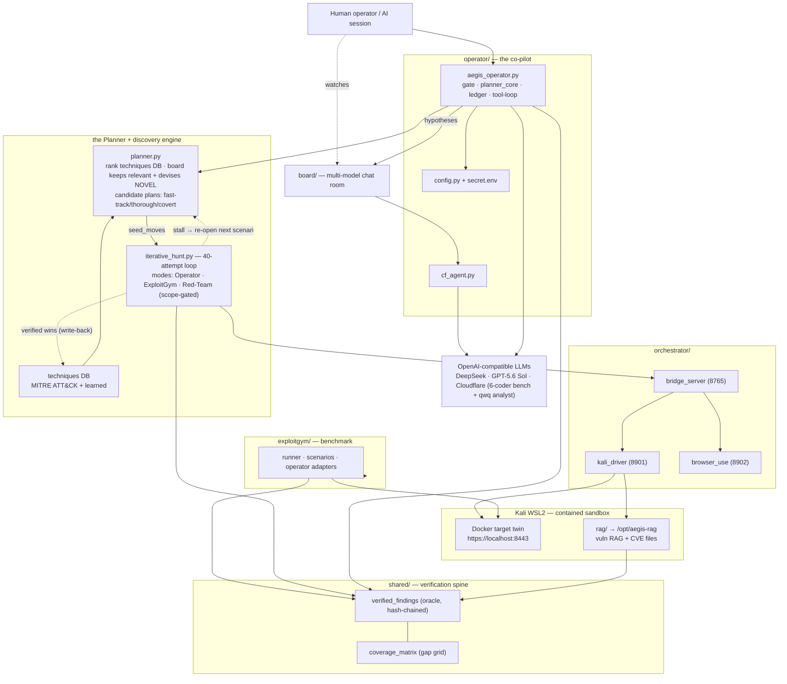

# Aegis Operator — Architecture Diagram

Standalone toolkit for authorized, contained security research + AI-operator benchmarking. Everything below ships in one folder and runs from it.

```
                                 ┌───────────────────────────────────────────────────┐
                                 │                    HUMAN OPERATOR                   │
                                 │        (you / a loaded AI session — Claude)        │
                                 └───────────────┬───────────────────┬───────────────┘
                                                 │ drives            │ watches
                    ┌────────────────────────────┼───────────────────┼─────────────────────────────┐
                    │                             ▼                   ▼                             │
                    │   ┌──────────────────────────────────┐   ┌──────────────────────────┐        │
                    │   │      operator/aegis_operator.py    │   │        board/            │        │
                    │   │      THE CO-PILOT (LLM in seat)    │   │   multi-model CHAT ROOM  │        │
                    │   │  ┌──────────────────────────────┐  │   │  live_board.ps1 +        │        │
                    │   │  │ approval GATE  │ planner_core │  │   │  board_view.py           │        │
                    │   │  │ ledger/memory  │ tool-loop    │  │   │  (FINDING/HUNCH/ASK/…)   │        │
                    │   │  └──────────────────────────────┘  │   └─────────▲────────────────┘        │
                    │   │   provider: deepseek│openai│cf     │             │ posts               A   │
                    │   └───────┬───────────────────┬────────┘             │                     E   │
                    │           │ tool calls (HTTP) │ config               │ cf_agent.py         G   │
                    │           │                   │ (keys)      ┌────────┴─────────┐          I   │
                    │           ▼                   ▼             │ Cloudflare       │          S   │
                    │  ┌─────────────────┐  ┌──────────────┐      │ Workers AI       │          -   │
                    │  │  orchestrator/  │  │  config.py   │      │ (open models:    │          O   │
                    │  │  bridge_server  │  │  secret.env  │      │  gpt-oss-120b …) │          P   │
                    │  │  (8765) tool-   │  └──────────────┘      └──────────────────┘          E   │
                    │  │  calling loop   │         ▲  keys: DeepSeek / OpenAI(Sol) / CF          R   │
                    │  └───┬─────────┬───┘         │                                             A   │
                    │      │         │             └───── OPENAI-COMPATIBLE LLM APIs ────────►   T   │
                    │      ▼         ▼                     (DeepSeek · OpenAI GPT-5.6 Sol)       O   │
                    │  ┌────────┐ ┌──────────────┐                                              R   │
                    │  │ kali_  │ │ browser_use  │                                                  │
                    │  │ driver │ │ (8902)       │       ┌──────────────────────────────────┐      │
                    │  │ (8901) │ │ Playwright   │       │   exploitgym/  BENCHMARK           │      │
                    │  │ run_   │ │ browser MCP  │       │  runner · scenarios · operators   │      │
                    │  │ command│ └──────────────┘       │  (claude · deepseek · sol adapters)│      │
                    │  └───┬────┘                        └──────────────┬────────────────────┘      │
                    │      │ shell (root)                               │ scores from ground truth   │
                    │      ▼                                            ▼                            │
                    │  ╔═══════════════════════════════╗   ┌──────────────────────────────────┐     │
                    │  ║   KALI WSL2 (kali-linux)      ║   │        shared/  VERIFICATION      │     │
                    │  ║  ┌─────────────────────────┐  ║   │  verified_findings.py  (oracle-  │     │
                    │  ║  │ Docker: TARGET TWIN     │◄─╫───┤  gated, hash-chained store)      │     │
                    │  ║  │ (disposable, synthetic) │  ║   │  coverage_matrix.py  (gap grid)  │     │
                    │  ║  │ https://localhost:8443  │  ║   │  candidate ─▶ verified/rejected  │     │
                    │  ║  └─────────────────────────┘  ║   └──────────────────────────────────┘     │
                    │  ║  ┌─────────────────────────┐  ║              ▲                              │
                    │  ║  │ rag/  →  /opt/aegis-rag │  ║              │ both write findings here     │
                    │  ║  │ offline vuln RAG + CVE  │──╫──────────────┘  (operator + exploitgym)     │
                    │  ║  │ files (NVD/KEV/EPSS/…)  │  ║                                             │
                    │  ║  └─────────────────────────┘  ║      CONTAINED · NON-DESTRUCTIVE · NO      │
                    │  ╚═══════════════════════════════╝      OFF-BOX EGRESS · PLANT-NOT-ERASE      │
                    └──────────────────────────────────────────────────────────────────────────────┘

  Legend:  ─▶ data/tool flow      ╔═╗ isolated sandbox boundary      (port) listening service
```

## The Planner → discovery engine → re-open (plan stage, all three run modes)

Before any run mode executes, **the Planner** (`operator/planner.py`, distinct from the task-graph
executor `planner_core.py`; full design in `docs/PLANNER.md`) builds the plan and seeds the shared
~40-attempt loop; a bounded mid-run **re-open** swaps in the next candidate scenario on a stall.

```
   objective + target
          │
          ▼
   ┌──────────────────────────────────────────────────────────────┐        ┌───────────────────────┐
   │  THE PLANNER  (operator/planner.py)                            │◀──────│  techniques DB         │
   │  fingerprint → rank prior-successful (technique, tool)         │  read  │  MITRE ATT&CK (ingest_ │
   │  → board keeps ONLY relevant + devises NOVEL approaches        │        │  mitre.py→mitre_attack │
   │  → candidate plans: fast-track / thorough / covert  (scored)   │        │  .json) + learned      │
   └───────────────┬───────────────────────────────────────────────┘        └───────────▲───────────┘
                   │ plans[0] seed_moves (rest = re-open queue)                           │
                   ▼                                                    verified wins ─────┘
   ┌──────────────────────────────────────────────────────────────┐   (record_success, closed loop)
   │  SHARED DISCOVERY ENGINE  (operator/iterative_hunt.py)         │
   │  budgeted 40-attempt loop · diversity / novelty / info-gain    │
   │  run modes:  Operator (iterative_hunt_live.py)                 │
   │              ExploitGym (exploitgym/.../iterhunt.py)           │
   │              Red-Team (redteam/redteam.py, scope-gated + pivot) │
   └───────────────┬───────────────────────────────────────────────┘
                   │ stall (board_saturation / diminishing_returns / max_board_rounds)
                   └──────── RE-OPEN next scenario (reopen=, max_reopens=2) ──────▲ back to the Planner
```

## Mermaid (editable) view



---

## Execution sequence (how a run actually executes)

Structural views above show *what the pieces are*; this shows *how one run flows at runtime* — the co-pilot's approval-gated tool-loop, the bridge's checkpoint/pause/resume, oracle verification, and where the board code-bench plugs in.

```mermaid
sequenceDiagram
    actor H as Human / AI session
    participant CP as operator<br/>aegis_operator.py
    participant BD as board/<br/>+ code bench
    participant BR as bridge_server<br/>(8765)
    participant CK as checkpoints/<br/>task_id.json
    participant KD as kali_driver<br/>(8901)
    participant TW as Docker twin<br/>:8443 (Kali)
    participant VF as shared/<br/>verified_findings + coverage
    participant LLM as LLMs<br/>DeepSeek · Sol · CF

    H->>CP: --task "objective" (--target-mode mirror)
    CP->>LLM: planner_core → verified task graph
    Note over CP,BD: THE PLANNER (planner.py): rank techniques DB → board keeps<br/>relevant + devises novel → seed_moves (fast-track/thorough/covert)
    Note over CP,BD: board consulted at decision points (0,2,4,5,7,10)
    CP->>BD: post hypothesis / question
    BD->>LLM: code bench — 6 coders (qwen-coder · ds · kimi · llama-3.3 · llama-4-scout · r1-distill) → TARGET/CODE/ORACLE
    BD-->>CP: suggestions (attributed) · qwq-32b analyst second opinion
    Note over CP,TW: on stall the Planner RE-OPENS with the next candidate scenario (bounded)

    CP->>H: approval GATE (before each intrusive action)
    H-->>CP: approve (or --auto-approve in sandbox)

    CP->>BR: {prompt, mcp_servers, task_id}
    BR->>CK: acquire per-task_id lock; load checkpoint if resume
    loop tool-calling loop (per step)
        BR->>LLM: next action (OpenAI-compatible)
        LLM-->>BR: tool call
        BR->>KD: run_command (root shell)
        KD->>TW: non-destructive probe (plant/read, never erase)
        TW-->>KD: HTTP / DB / DOM response
        KD-->>BR: result
        BR->>CK: save checkpoint (survives compaction)
        Note over BR,CK: .pause flag → stop cleanly; same task_id resumes later
    end
    BR-->>CP: transcript + candidate findings

    CP->>VF: record candidate
    VF->>TW: ORACLE check (HTTP/DB/DOM/callback/cross-account)
    TW-->>VF: ground-truth outcome
    Note over VF: candidate → verified / rejected · ≥2-confirmation for HIGH<br/>hash-chained append under a cross-process lock
    VF->>VF: mark coverage cell (surface, method, role, technique)

    CP->>TW: test_suggestions.py — run board code vs mirror<br/>(non-destructive guard + snapshot-restore)
    CP->>TW: credential_replay — post-exploit chain (over-read / IDOR / privesc)
    CP->>VF: record + attribute results

    alt gaps remain
        CP->>TW: mirror_snapshot restore → loop back to novel discovery (stage 7)
    else coverage sufficient
        CP->>H: finalize report (verified findings + coverage matrix)
    end
```

*Automation loops:* `board_feedback.py` / `collective.py` drive the board→synthesize→verify cycle unattended; the dormant `AEGIS_SCHEDULER_URL` hook could front the bridge but is unused (the co-pilot self-plans via `planner_core`).

---

## Framework parts (bottom legend)

| Part | Where | What it does |
|---|---|---|
| **Operator co-pilot** | `operator/aegis_operator.py` | An LLM in the operator seat with a human **approval gate**, an audit **ledger** + **memory** (survive compaction), and a direct tool-loop. Providers: `deepseek` \| `openai` (Sol) \| `cloudflare`. |
| **Task-graph planner** | `operator/planner_core.py` | Turns an objective into a verified, bounded task graph for multi-step work — no external scheduler needed. (Distinct from the strategic Planner below.) |
| **The Planner (strategy)** | `operator/planner.py` | Pre-execution PLAN stage before the loop: fingerprint → rank prior-successful `(technique, tool)` from the techniques DB → board keeps ONLY relevant + devises NOVEL approaches → `candidate_plans` (fast-track/thorough/covert) → `seed_moves`; `PlannerSession`/`plan_session` feed the loop and mid-run **re-open**; `record_success` writes verified wins back. Kill-switch `AEGIS_PLANNER=0`. See `docs/PLANNER.md`. |
| **Discovery engine + run modes** | `operator/iterative_hunt.py` + `operator/vectors.py` | The shared budgeted ~40-attempt loop (diversity / novelty / information-gain; `reopen=`/`max_reopens=2`) over the shared vector dispatch, driven by three modes: **Operator** (`iterative_hunt_live.py`), **ExploitGym** (`exploitgym/.../iterhunt.py`), **Red-Team** (`redteam/redteam.py`). |
| **Red-Team** | `redteam/redteam.py` + `authorization.py` + `lateral.py` | Scope-enforcing run mode with cross-host pivot chaining. `classify_probe` guards on TWO axes (safety + scope): safe read-only recon allowed in-scope & on research hosts; destructive / out-of-scope blocked — non-destructiveness is **not** authorization. Doctrine in `redteam/DOCTRINE.md`. |
| **Techniques DB (Planner)** | `rag/techniques_db.json` + learned + `rag/mitre_attack.json` | HOW-to-test + Kali-tool/new-code mapping per technique, populated from **MITRE ATT&CK** (`rag/ingest_mitre.py`) and learned wins; queried by `rag/technique_search.py`; live-refreshed like the CVE feeds (a `mitre` feed in `rag_update.py`). |
| **Orchestrator — bridge** | `orchestrator/bridge_server.py` (8765) | The executor: an OpenAI-compatible tool-calling loop with the data-boundary / anti-hallucination system prompt. |
| **Orchestrator — kali_driver** | `orchestrator/kali_driver_server.py` (8901) | One MCP tool, `run_command`, running shell as root inside Kali WSL (where the tools + twin live). |
| **Orchestrator — browser_use** | `orchestrator/browser_use_server.py` (8902) | Playwright browser automation exposed as MCP tools. |
| **ExploitGym** | `exploitgym/` | Contained autonomous-exploitation **benchmark**: run one/many operators vs. a scenario, scored from ground truth (`run` \| `bench` \| `suite` \| `report`). |
| **Verification spine** | `shared/verified_findings.py` | Oracle-gated, event-sourced, **hash-chained** findings store: `candidate → verified/rejected`. Only verified counts; `verify_chain()` detects tampering. |
| **Coverage matrix** | `shared/coverage_matrix.py` | Records tested `(surface, method, role, technique)` cells so untested **gaps** stay visible. |
| **RAG + CVE files** | `rag/` → `/opt/aegis-rag` | Offline vuln knowledge store: NVD / KEV / EPSS / Exploit-DB / Metasploit / PoC-GitHub / nuclei ingest scripts + `rag_db.py`; queried by the operator's `rag_search`. Boot service via `rag/systemd/`. |
| **Chat room (board)** | `board/` + `operator/cf_agent.py` | File-based multi-model **blackboard**: models post FINDING/HUNCH/ASK/ANSWER/STRATEGY; `live_board.ps1` renders it live. Cloudflare open models (`board_roster.json`, `cf_models.json`) join cheaply. Many suggest; one operator executes + verifies. |
| **Code bench (6 coders)** | `operator/code_suggester.py` | Six coders emit **runnable** `TARGET/CODE/ORACLE` blocks: `qwen2.5-coder-32b`, `ds` (deepseek-v4-pro direct), `kimi-k2.7-code`, `llama-3.3-70b`, `llama-4-scout`, `deepseek-r1-distill-32b` (CF paid or DeepSeek direct; graceful skip). `qwq-32b` (`AEGIS_ANALYST_MODEL`) is the analyst/verifier second opinion (`review_suggestions`). |
| **Board code-review** | `operator/code_review.py` | Periodic self-review: the six coders review the Aegis **codebase itself** → structured findings; `qwq-32b` consolidates a prioritized plan (`code_review_report.md`). Secret-looking lines redacted before any file reaches a model; advisory only. Distinct from Claude Code's `/code-review`. |
| **Suggestion tester** | `operator/test_suggestions.py` | The co-pilot **runs** each suggestion against the mirror behind a non-destructive guard, checks the oracle, and records verified/rejected **attributed to the source model**. |
| **Mirror / twin (built in stage 2)** | Docker in Kali, `https://localhost:8443` | The disposable **copy of the real target** that all aggressive testing hits — never production. Prefer a **real mirror** (actual code + synthetic data, high fidelity); a **scaffold reconstruction** (behavioural, low fidelity) is the fallback. Snapshot the baseline for reset/rollback; record fidelity + divergences. |
| **Secrets** | `secret.env` / `set-env.local.ps1` (gitignored) | LLM keys, Cloudflare token, knobs. Copy from the `.example` files. |
| **Launcher** | `start-all.ps1` | Brings up kali_driver + browser_use + bridge; prints how to run the operator / gym / board. |

## Discovery workflow (the canonical flow — see `PIPELINE.md` for the full version)

**Setup (once):** `pip install -r requirements.txt`; set up Kali WSL + Docker; copy the `.example`
secret files and fill in your LLM key; (optional) build the RAG store (`INSTALL.md` §4); `./start-all.ps1`.

**Plan stage (before execution):** the **Planner** (`operator/planner.py`) fingerprints the target,
ranks prior-successful techniques from the techniques DB (MITRE ATT&CK + learned), has the board keep
only what's relevant and devise NOVEL approaches, and seeds the ~40-attempt loop with candidate plans
(fast-track/thorough/covert) — re-opening the next scenario mid-run on a stall. See `docs/PLANNER.md`.

**Per target (the pipeline — v3):**
0. **Scope & authorize** — contained mirror only; authorization artefact; non-destructive. *(board decision point)*
1. **Survey & fingerprint the REAL target** (kali_driver + source-read in grey-box).
2. **Threat-model / asset-rank** — rank the surface by impact so scan depth targets high-value assets. *(board decision point)*
3. **Credential-exposure recon** — OPTIONAL, largely MANUAL (reliable sources paid); any cred found feeds stage 9.
4. **BUILD THE MIRROR + VALIDATE FIDELITY** — real mirror (code + synthetic data) preferred, scaffold fallback;
   **snapshot** baseline; run a fidelity test-set and **record measured divergence**. All aggressive testing hits this. *(board decision point)*
5. **Known-vuln pass** — fingerprint → CVEs via `rag_search` + `exploit_search`. *(board decision point)*
6. **Confirm** known exploits via Kali (oracle-verify; a non-firing CVE is refuted unless stage-4 fidelity says the twin diverges).
7. **Novel discovery (credentialed, per-role)** — (a) board hunches; the **6-coder code bench** (qwen-coder · ds · kimi ·
   llama-3.3 · llama-4-scout · r1-distill) emits runnable code, `qwq-32b` reviews (gpt-oss contribute ideas, not code); (b) deterministic methods. *(board decision point)*
8. **Run the suggested code** against the mirror (`test_suggestions.py`, non-destructive guard + snapshot-restore).
9. **Confirm — the oracle DECIDES** (HTTP/DB/DOM/callback/cross-account); Claude interprets, not sole judge; **≥2-confirmation
   consensus for HIGH**. Then **post-exploit / chain** (`credential_replay`: over-read/IDOR/privesc). Record + attribute.
10. **Loop / remediation report** — coverage matrix + metrics: gaps → reset snapshot, back to 7; else the **remediation round** (`remediation_board.py`): each VERIFIED weakness → whole panel proposes the fix on the board (attributed to source) + consensus. Two audiences: *known-cve* → RAG-filled framework/dependency **update for ADMINS**; *novel* → panel-designed **code fix for the CODE WRITER/IMPROVER** (`--emit-fixes` → code-bench patch, non-destructive). Durable two-track report + `--write-ledger` chains the remediation onto the hash-chained ledger. End of pipeline. *(board decision point)*

**Board (v3):** consulted at the decision points above (available everywhere, not blocking every step); **data-hygiene** —
privileged context (creds/secrets, sensitive target specifics) is sanitized before generalist models see it.

**Track refinements:** direct co-pilot test = approval checkpoint past the guard + `--max-iter` time-box;
ExploitGym = per-episode snapshot reset, reward shaping (partial-exploit credit), curriculum, metrics.

*Doctrine: contained mirror only · non-destructive (plant/write for proof, never erase) · no off-box
egress · no external-agent recruitment · findings scored from ground truth, never a model's self-report.*
